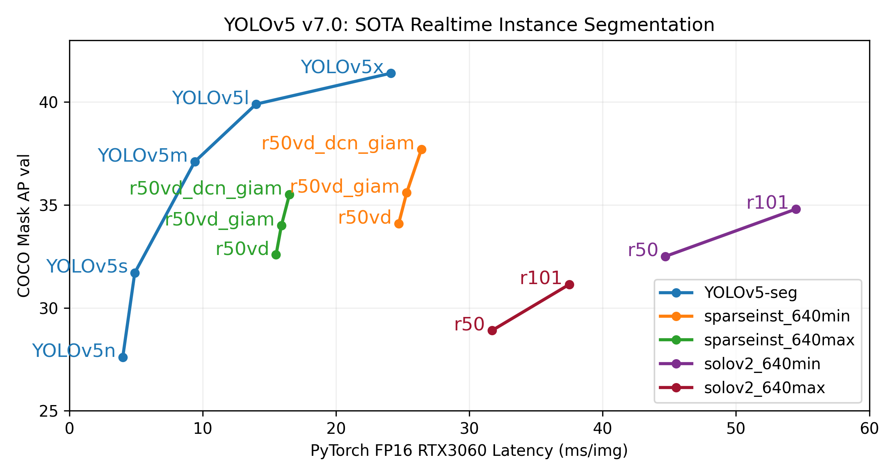
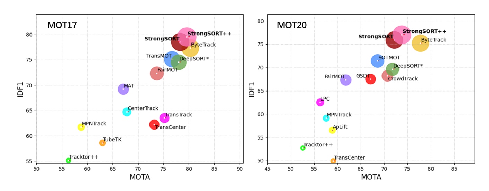

 # 차량인지 플랫폼 S/W 


<div align="center">
<p>
 
</p>
</div>

# Acknowledgement
* 본 S/W는 과학기술정보통신부 자율주행 기술개발 혁신사업 "차량 보안 위협 방지를 위한 공격대응 및 지능형 RSU 기술 개발" 과제의 지원으로 개발 되었습니다

## 개요
* 자율주행협상을 위한 차량인지 알고리즘 공개 S/W임
* 해당 repository는 차량 인지에 쓰이는 객체 검출 모델 ([YOLOv5](https://github.com/ultralytics/yolov5/tree/v7.0)), 객체 추적 모델 ([StrongSORT](https://arxiv.org/abs/2202.13514)), 자율차 분류 모델([OSNet](https://arxiv.org/abs/1905.00953)) 코드가 포함되어 있음
* 해당 모델들은 1차년도에 가공한 실증구간 데이터로 학습되고 진행이 되었음 [데이터 링크](https://github.com/chamchi99/2021-C3-CCTV-DB-on-RSU)
* 인지 알고리즘은 객체 검출 모델로 차량을 검출한후 검출한 모형으로 개별의 객체를 추적을함
* 분류 알고리즘은 추적된 객체들을 자율차량인지 아닌지 분류함
<div align="center">
<p>
 
</p>
</div>

<div>

</div>

## 모델 설명
<details>
<summary>객체 검출 모델(YOLOv5)</summary>

* 벤치마크 테스트에서 높은 정확도화 빠른 Inference 속도를 가진 One-Stage 객체 검출 모델임
* 과제를 수행하기위해 실시간성 처리 속도와 높은 검출 정확도가 필요함으로 해당 모델을 선별함
* 좀더 detail한 모형 설명은 개발자 [웹사이트](https://github.com/ultralytics/yolov5/tree/v7.0) 참고
<div align="center">
<p>
 
</p>
</div>

  </details>

<details>
<summary>객체 추적 모델(StrongSORT)</summary>

* StrongSORT는 [DeepSORT](https://arxiv.org/abs/1703.07402) 객체 추적 모델에 Gaussian Process Regression(GPR) 등 알고리즘들을 추가하여 성능을 보완한 모델임
* 높은 추적 성능을 가지고 있어 해당 모델을 선별함
* Deep backbone 모델로는 OSNet을 사용함
* 좀더 detail한 모형 설명은 [논문](https://arxiv.org/abs/2202.13514) 참고
<div align="center">
<p>
 
</p>
<p>
 
</p>
</div>


  </details>


<details>
<summary>객체 분류 모델(OSNet)</summary><br>

* Multi-scale의 feature들을 효과적으로 aggregation하는 방법론을 제안한 모델임
* Moiblenet에서 제안한 Depthwise seperable convolution module을 사용하여 연산량을 줄임
* 높은 차량간 분류 성능과 함께 적은 연산량만을 필요로 하므로 해당 모델을 선정 
* 좀더 detail한 모형 설명은 [논문](https://arxiv.org/abs/1905.00953) 참고

<div align="center">
<p>
 
</p>
</div>

  </details>


<div>


</div>


## 개발환경

* 개발환경은 Docker에서 진행되었으며 관련 Docker 이미지는 [Docker 링크](https://hub.docker.com/r/ultralytics/yolov5)에서 확인할수 있음
<details>
<summary>Docker 설치 방법</summary>

* 코드를 실행할 컴퓨터 Terminal에서 도커 이미지 다운로드

```
docker pull ultralytics/yolov5
```
<div align="center">
<p>
 
</p>

</div>


* 도커 컨테이너 생성

```
docker run --gpus all -it --ipc=host --name=KETI_C3 -e DISPLAY=$DISPLAY --mount type=bind,source=/root,target=/home/super/Desktop/KETI_C3 ultralytics/yolov5/ 
```
<div align="center">
<p>
 
</p>

</div>


  </details>

<details>
<summary>VSCode에 도커 연결 방법</summary>

* 도커 컨테이너 생성을 확인한후 VSCode내 에서 컨테이너에 연결

```
In VSCode, run "Ctrl + Shift + P"
Select "Dev Containers:Attach to Running Container..."
```

<div align="center">
<p>
 
</p>

</div>

  </details>


<div>


</div>

## 설치

* KETI 차량인지 플랫폼 코드를 다운 받고 필수 라이브러리를 설치
```
git clone --recurse-submodules https://github.com/chamchi99/2022-C3-CCTV-Perception-and-Classification  #코드 다운로드
pip install -r requirements.txt  # 필수 라이브러리 설치
```
* 자세한 라이브러리 정보는 requirements.txt 문서 참조

## 모델 학습

<details>
<summary>객체 검출 모델 (YOLOv5) 학습</summary>

* MS COCO 데이터셋에 Pre-Train된 YOLOv5m 모형 weight 다운로드
* 파이썬 커널에서 아래코드를 실행시키면 자동으로 pre-trained weight가 다운로드 됨
```
import torch

model = torch.hub.load('ultralytics/yolov5', 'yolov5s', pretrained=True)
```

* 1차년도 학습데이터 [다운로드](https://github.com/chamchi99/2021-C3-CCTV-DB-on-RSU) 

```
cd yolov5/data #해당디렉토리에 학습데이터 다운로드
```
  
* 학습데이터 tree

```
#학습데이터
yolov5/data/train
    ㄴimages
        ㄴimg1.jpg
        ㄴimg2.jpg
    ㄴlabels
        ㄴlabel1.txt
        ㄴlabel2.txt

#검증데이터
yolov5/data/val
    ㄴimage
        ㄴimg1.jpg
        ㄴimg2.jpg
    ㄴlabel
        ㄴlabel1.txt
        ㄴlabel2.txt
```
<div align="center">
<p>
 
</p>

</div>
  
  
  
* YOLOv5 모델 학습
```
cd yolov5
python train.py  --batch 64 --data dataset.yaml --weights yolov5m.pt --device 0 #YOLOv5m 모델 학습
```
<div align="center">
<p>
 
</p>

</div>


* YOLOv5 모델 결과

```
yolov5/runs/train/exp #해당 디렉토리에 학습 결과 저장됨
```

<div align="center">
<p>
 
</p>

</div>


  </details>


<details>
<summary>객체 분류 모델 (OSNet) 학습</summary><br>

* 1차년도 학습데이터 [다운로드](https://github.com/chamchi99/2021-C3-CCTV-DB-on-RSU) 
```
cd osnet_training/reid-data/cdataset # 해당 디렉토리에 학습데이터 다운로드
```

* 학습데이터 tree
```
osnet_training/reid-data/cdataset
    ㄴimages
        ㄴimg1.jpg
        ㄴimg2.jpg
    ㄴlabels
        ㄴlabel1.txt
        ㄴlabel2.txt
 ```
 
 * 학습데이터 preprocessing
```
cd osnet_training
sh preprocess.sh
```
* 본 코드는 [torchreid](https://github.com/KaiyangZhou/deep-person-reid) 기반으로 작성됨. 해당 가이드에 따라 필요 라이브러리 설치

* OSNET 모델 학습
```
python scripts/main.py --config-file configs/im_osnet_x1_0_softmax_256x128_amsgrad_cosine.yaml -s customdata -t customdata --transforms random_flip random_erase --root reid-data
```

* OSNET 모델 결과
```
osnet_training/log/osnet_x1_0_customdata_softmax_cosinelr/model #해당 디렉토리에 학습결과 저장됨
```

 </details>
 
  

## Model Inference

<details>
<summary>객체 검출 모델(YOLOv5)</summary>

* YOLOv5 모델 inference

```
cd yolov5
python detect.py --source data/*.jpg --weight  runs/train/exp/best.pt --batch-size 32
```
<div align="center">
<p>
 
</p>

</div>


* YOLOv5 inference 결과

```
yolov5/runs/detect/exp #해당 디렉토리에 inference 결과 저장됨
```
<div align="center">
<p>
 
</p>

</div>

  
</details>

<details>
<summary>객체 추적 모델(StrongSORT)</summary>

* StrongSORT 모델 inference
* 실증구간 학습데이터로 학습된 YOLOv5 weight 사용 함

```
python track_only.py --save-vid  --source mp4/ch02_lane1_50km.mp4 --agnostic-nms --yolo-weights yolov5/runs/train/exp/best.pt
```
<div align="center">
<p>
 
</p>

</div>

* StrongSORT 모델 inference 결과

```
runs/track/exp #해당 디렉토리에 inference 결과 저장됨
```


<div align="center">
<p>
 
</p>
<p>
 
</p>
 
  
</div>


</details>

<details>
<summary>객체 분류 모델(OSNet)</summary><br>

* 자율차 분류를 포함한 inference 코드

```
python track_cls.py --source sample.mp4 --yolo-weights weights/yolov5m.pt --appearance-descriptor-weights weights/osnet_x1_0_vehicle.pt --classes 2 5 7 --agnostic-nms --show-vid
```

* 자율차 분류 inference 결과
<div align="center">
<p>
 
</p>
<p>
 
</p>

</div>


</details>

# Contact
한국전자기술연구원 모빌리티 플랫폼연구센터
* 윤상훈 (Sanghoon Yoon) 책임연구원 / shyoon11@keti.re.kr
* 장수현 (Soohyun Jang)  책임연구원 / shjang@keti.re.kr 
